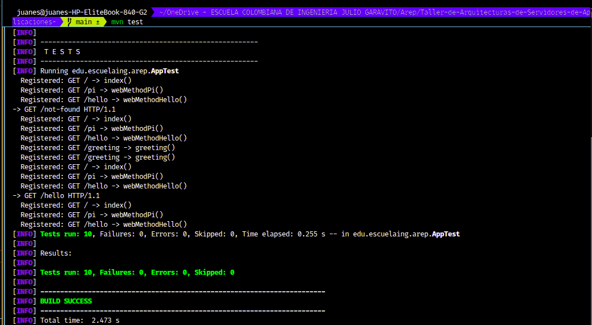

# MicroSpringBoot - Java Web Application Server

Minimal HTTP server built with **plain Java** (no Spring Boot, no Servlets, no Jetty).  
It implements an IoC framework that detects web components using reflection and runtime annotations.

## Architecture

```
HTTP Request (TCP)
       |
       v
 HttpServer (ServerSocket on port 8080)
       |
       |- Is it a static file (.html, .png)?
       |        \--> getResourceAsStream("/webroot/...")  -> response with correct Content-Type
       |
       \- Is it a registered route?
                \--> MicroSpringBoot.invoke(method, instance, queryParams)
                              |
                              \--> Reflection: resolve @RequestParam -> invoke method -> return String
```

**Framework classes:**

- `@RestController` - Marks a class as a web component detectable by the scanner.
- `@GetMapping` - Maps a method to an HTTP GET route.
- `@RequestParam` - Extracts parameters from the URL query string.
- `MicroSpringBoot` - Reflection engine: loads controllers, registers routes, invokes methods.
- `HttpServer` - HTTP server over `ServerSocket`. Handles requests in a non-concurrent way.
- `ClassPathScanner` - Scans the classpath looking for `@RestController` automatically.
- `MicroSpringBootApp` - Final entry point: scan + integrated HTTP server.

**Example controllers:**

- `HelloController` - Three simple routes without parameters (`/`, `/hello`, `/pi`).
- `GreetingController` - Route with `@RequestParam` (`/greeting?name=X`).

## Requirements

- Java 17 or higher
- Maven 3.6 or higher

## Installation
```bash
git clone https://github.com/Juan-cely-l/Taller-de-Arquitecturas-de-Servidores-de-Aplicaciones-.git
cd Taller-de-Arquitecturas-de-Servidores-de-Aplicaciones
mvn compile
```

## Running

### Version 1 - Load one controller from the command line

```bash
java -cp target/classes edu.escuelaing.arep.MicroSpringBoot \
     edu.escuelaing.arep.HelloController /pi
```

Expected output:
```
  Registered: GET / -> index()
  Registered: GET /pi -> webMethodPi()
  Registered: GET /hello -> webMethodHello()
Result: Pi= 3.141592653589793
```

### Final Version - Full HTTP server with automatic scanning

```bash
java -cp target/classes edu.escuelaing.arep.MicroSpringBootApp
# Or with Maven:
mvn exec:java -Dexec.mainClass="edu.escuelaing.arep.MicroSpringBootApp"
```

Expected output:
```
=== Starting MicroSpringBoot Framework ===
  [SCAN] Loading: edu.escuelaing.arep.GreetingController
    Registered: GET /greeting -> greeting()
  [SCAN] Loading: edu.escuelaing.arep.HelloController
    Registered: GET / -> index()
    Registered: GET /pi -> webMethodPi()
    Registered: GET /hello -> webMethodHello()
Available routes: [/, /pi, /hello, /greeting]
Listening on http://localhost:8080
```

## Available Endpoints

| Route | Description |
|---|---|
| `GET /` | Main greeting |
| `GET /hello` | Hello World |
| `GET /pi` | Pi value |
| `GET /greeting` | Greeting with default value ("World") |
| `GET /greeting?name=Carlos` | Custom greeting |
| `GET /index.html` | Static HTML page |
| `GET /logo.png` | Static PNG image |

```bash
curl http://localhost:8080/hello
curl "http://localhost:8080/greeting?name=Maria"
curl -I http://localhost:8080/logo.png
```

## Automated Tests

```bash
mvn test
```


```

Tests verify:
- RUNTIME retention for all three annotations.
- Correct route registration when loading a controller.
- Rejection of classes without `@RestController`.
- Invocation of methods without parameters.
- Resolution of `@RequestParam` with provided value.
- Use of `defaultValue` when the parameter is missing in the URL.
- Query string parsing with multiple parameters.
- Correct HTTP response format (status, Content-Length, body).
- Server returns 200 for `GET /hello` (mocked socket).
- Server returns 404 for unknown routes.

## Controller Example

```java
@RestController
public class GreetingController {

    private static final String TEMPLATE = "Hello %s";
    private final AtomicLong counter = new AtomicLong();

    @GetMapping("/greeting")
    public String greeting(@RequestParam(value = "name", defaultValue = "World") String name) {
        return String.format(TEMPLATE, name) + " (visit #" + counter.incrementAndGet() + ")";
    }
}
```


## Visual Evidence (Assets)

### 1. Phase 1 execution from CLI
This screenshot shows the execution of the first phase using `mvn exec:java` with `HelloController` and the `/pi` route. It confirms route registration and successful method invocation in console mode.


### 2. GET `/`
This screenshot validates the root endpoint response. The server returns the main greeting text from `HelloController#index`.


### 3. GET `/greeting`
This screenshot shows the default behavior of `GreetingController#greeting` when no `name` query parameter is provided. It uses the fallback value and increments the visit counter.


### 4. GET `/greeting?name=Esteban`
This screenshot demonstrates query parameter resolution with `@RequestParam`. The response includes the provided name (`Esteban`) and the updated visit count.


### 5. GET `/hello`
This screenshot validates the fixed string response for the `/hello` endpoint from `HelloController#webMethodHello`.


### 6. GET `/pi`
This screenshot shows the `/pi` endpoint returning the value of `Math.PI`, confirming that numeric values are correctly serialized as plain text HTTP responses.


### 7. GET `/index.html`
This screenshot shows the static HTML page served from `/webroot/index.html`. It confirms static file resolution from the classpath and proper rendering of the index page with links to the available endpoints.


### 8. GET `/logo.png`
This screenshot validates direct static image delivery for `/logo.png`. It confirms that the server returns the PNG resource with the expected content and browser rendering behavior.


## Design Decisions

**Non-concurrent by design**: The assignment asks for this explicitly. The `while(true)` in `HttpServer.start()` handles one request at a time. For production, an `ExecutorService` or `VirtualThreads` would be used, but for this educational prototype the sequential loop is correct and easier to debug.

**`getResourceAsStream()` for static files**: Works both in development (`target/classes/`) and packaged in a JAR, without hardcoding OS filesystem paths.

**Separation of responsibilities**: `MicroSpringBoot` only handles reflection. `HttpServer` only handles TCP/HTTP. `ClassPathScanner` only handles classpath discovery. This makes each class independently testable.
